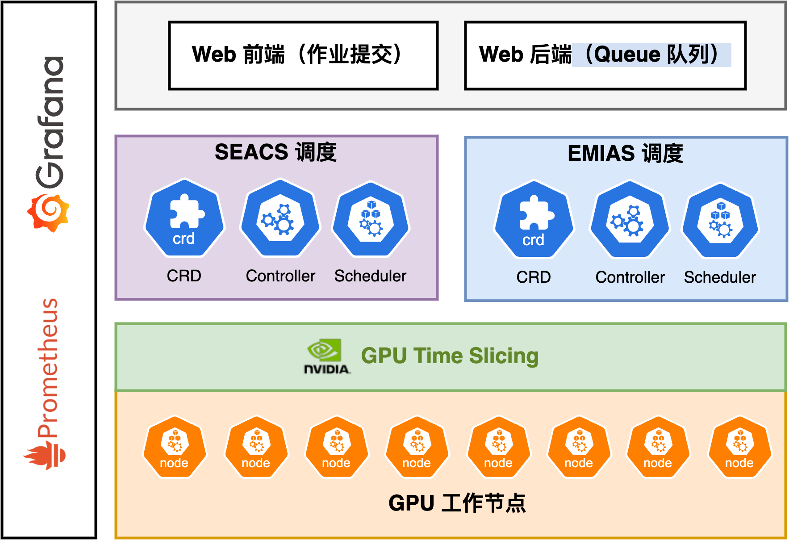

# Crater


# About Crater

**Crater** is a university-developed cluster management platform designed to provide users with an efficient and user-friendly solution for managing computing clusters. It offers unified scheduling and management of computing, storage, and other resources within a cluster, ensuring stable operation and optimal resource utilization.

## Features

### 🎛️ Intuitive Interface Design
Crater features a clean and easy-to-use graphical user interface that enables users to perform various cluster management tasks effortlessly. The resource dashboard provides real-time insights into key metrics such as CPU utilization, memory usage, and storage capacity.  
The job management interface allows users to monitor running jobs, view job queues, and access job history, making it easy to track and control task execution.

### ⚙️ Intelligent Resource Scheduling
The platform employs smart scheduling algorithms to automatically allocate the most suitable resources to each job based on priority, resource requirements, and other factors. For example, when multiple jobs request resources simultaneously, Crater can quickly analyze the situation and prioritize critical and time-sensitive tasks to improve overall efficiency.

### 📈 Comprehensive Monitoring
Crater offers detailed monitoring data and logging capabilities, empowering users with deep visibility into cluster operations. These features facilitate quick troubleshooting and performance tuning, helping maintain system stability and responsiveness.

---
## Overall Architecture


## Installation

To get started with **Crater**, you first need to have a running Kubernetes cluster. You can set up a cluster using one of the following methods:

### 🐳 1. Local Cluster with Kind  
Kind (Kubernetes IN Docker) is a lightweight tool for running local Kubernetes clusters using Docker containers.  
📖 [https://kind.sigs.k8s.io/](https://kind.sigs.k8s.io/)

### 🧱 2. Local Cluster with Minikube  
Minikube runs a single-node Kubernetes cluster locally, ideal for development and testing.  
📖 [https://minikube.sigs.k8s.io/](https://minikube.sigs.k8s.io/)

### ☁️ 3. Production-grade Kubernetes Cluster  
For deploying Crater in a production or large-scale test environment, you can use any standard Kubernetes setup.  
📖 [https://kubernetes.io/docs/setup/](https://kubernetes.io/docs/setup/)

---

## Deployment (via Helm)

Crater provides Helm charts for simple and configurable deployment.

### 🔧 Prerequisites

Make sure Helm is installed on your system:  
📖 [https://helm.sh/docs/intro/install/](https://helm.sh/docs/intro/install/)

Before deploying Crater, please make sure your Kubernetes cluster has the following dependencies installed. All components can be installed via Helm. We provide both official documentation links and local step-by-step guides under the [`docs/`](./docs) folder.

#### 📦 Cluster Resource Dependencies

| Component           | Purpose                                  | Official Docs                                              | Local Guide                    |
|---------------------|-------------------------------------------|------------------------------------------------------------|--------------------------------|
| OpenEBS             | Persistent storage management CRDs        | [openebs.io](https://openebs.io/docs/next/installation)    | [docs/openebs.md](./docs/openebs.md) |
| CloudNativePG       | PostgreSQL database service               | [cloudnative-pg.io](https://cloudnative-pg.io/docs/)       | [docs/cloudnative-pg.md](./docs/cloudnative-pg.md) |
| Prometheus Stack    | Monitoring stack (Prometheus, Grafana)    | [prometheus-community](https://github.com/prometheus-community/helm-charts) | [docs/prometheus.md](./docs/prometheus.md) |
| metrics-server      | Metrics API for autoscaling               | [metrics-server](https://github.com/kubernetes-sigs/metrics-server) | [docs/metrics-server.md](./docs/metrics-server.md) |
| NVIDIA GPU Operator | GPU device plugin and monitoring          | [nvidia.com](https://docs.nvidia.com/datacenter/cloud-native/gpu-operator/overview.html) | [docs/gpu-operator.md](./docs/gpu-operator.md) |

#### 🌐 Networking & Routing

| Component     | Purpose                             | Official Docs                                          | Local Guide                         |
|---------------|--------------------------------------|--------------------------------------------------------|--------------------------------------|
| MetalLB       | LoadBalancer support for bare metal  | [metallb.universe.tf](https://metallb.universe.tf/installation/) | [docs/metallb.md](./docs/metallb.md) |
| IngressClass  | Ingress traffic routing              | [kubernetes.io](https://kubernetes.io/docs/concepts/services-networking/ingress/) | [docs/ingress.md](./docs/ingress.md) |

#### 🧠 Scheduling & Orchestration

| Component  | Purpose                                 | Official Docs                                              | Local Guide                        |
|------------|------------------------------------------|------------------------------------------------------------|-------------------------------------|
| Volcano    | Base job scheduling framework            | [volcano.sh](https://volcano.sh/en/docs/installation/)     | [docs/volcano.md](./docs/volcano.md) |
| Aische     | Crater's custom intelligent quota scheduler *(coming soon)* | *(To be released)*                                | *(Coming soon)*  |
| Sparse     | Crater's custom sparse-aware scheduler *(coming soon)* | *(To be released)*                                  | *(Coming soon)* |

#### 🗃️ Platform Services

| Component     | Purpose                                | Official Docs                                                | Local Guide                         |
|----------------|-----------------------------------------|--------------------------------------------------------------|--------------------------------------|
| StorageClass (e.g. Ceph, NFS) | Distributed storage backend           | Varies by provider (e.g. [Rook-Ceph](https://rook.io/docs/rook/latest/)) | [docs/storage.md](./docs/storage.md) |
| Harbor         | Container image registry                | [goharbor.io](https://goharbor.io/docs/)                     | [docs/harbor.md](./docs/harbor.md) |


### 🚀 Quick Start

```bash
# Add Crater Helm repository (replace <repo-url> with actual URL)
helm repo add crater <repo-url>
helm repo update

# Install Crater with default settings
helm install crater crater/crater -n crater
```
### ✅ Verify Installation

```bash
kubectl get pods -n crater
```

### 🌐 Access the Dashboard

If using a NodePort service:

```bash
kubectl get svc -n crater
```
Then visit http://<NodeIP>:<NodePort> in your browser.

### 🛠️ Custom Configuration
You can override default values with your own values.yaml file:
```bash
helm install crater crater/crater -f my-values.yaml
```

## 💻 Development Guide

Before getting started with development, please ensure your environment has the following tools installed:

- **Go**: Version `v1.22.1` is recommended  
  📖 [Go Installation Guide](https://go.dev/doc/install)

- **Kubectl**: Version `v1.22.1` is recommended  
  📖 [Kubectl Installation Guide](https://kubernetes.io/docs/tasks/tools/)

### 📐 Code Style & Linting

This project uses [`golangci-lint`](https://golangci-lint.run/) to enforce Go code conventions and best practices. To avoid running it manually, we recommend setting up a Git pre-commit hook to automatically check the code before each commit.

After installation, you might need to add your GOPATH to the system PATH so that golangci-lint can be used in the terminal. For example, on Linux:

```bash
# Check your GOPATH
go env GOPATH
# /Users/your-username/go

# Add the path to .bashrc or .zshrc
export PATH="/Users/your-username/go/bin:$PATH"

# Reload the shell and verify
golangci-lint --version
# golangci-lint has version 1.61.0
```
#### Setting Up Git Pre-Commit Hook

Copy the `.githook/pre-commit` script to your Git hooks directory and make it executable:

**Linux/macOS:**
```bash
cp .githook/pre-commit .git/hooks/pre-commit
chmod +x .git/hooks/pre-commit
```
Windows:

* Copy the script to .git/hooks/pre-commit

* Modify the script to replace golangci-lint with golangci-lint.exe if needed, or adapt it into a .bat file.

With the hook in place, golangci-lint will automatically run on staged files before each commit.

### 📄 API Documentation (Swagger)
We use Swag to generate OpenAPI documentation. Please install it before development:
```bash
go install github.com/swaggo/swag/cmd/swag@latest
```
Before running the backend, make sure to initialize Swagger docs:
```bash
swag init
```

#### 🛠️ Database Code Generation
The project uses GORM Gen to generate boilerplate code for database CRUD operations.

Generation scripts and documentation can be found in: [`gorm_gen`](./cmd/gorm-gen/README.md)

Please regenerate the code after modifying database models or schema definitions, while CI pipeline will automatically make database migrations.

### 🚀 Running the Project
Install dependencies and plugins:
```bash
go mod download
```

Create a `.debug.env` file at the root directory to customize local ports. This file is ignored by Git:

```env
CRATER_FE_PORT=xxxx
CRATER_BE_PORT=xxxx
CRATER_MS_PORT=xxxx
CRATER_HP_PORT=xxxx
```
You will also need access to a Kubernetes cluster. The cluster admin will provide a `kubeconfig` file. Copy it to the backend project root and rename it as `kubeconfig`:
```bash
cp ./kubeconfig ./web-backend/kubeconfig
```
Then you can start the backend server:

```bash
make run
```
If the server is running and accessible at your configured port, you can open the Swagger UI to verify:
```bash
http://localhost:<your-backend-port>/swagger/index.html#/
```

### 🐞 Debugging with VSCode
You can start the backend in debug mode using VSCode by pressing F5 (Start Debugging). You can set breakpoints and step through the code interactively.

Example launch configuration:
```json
 {
            "name": "Debug Server",
            "type": "go",
            "request": "launch",
            "mode": "auto",
            "program": "${workspaceFolder}/main.go",
            "env": {
                "KUBECONFIG": "${workspaceFolder}/kubeconfig",
                "CRATER_DEBUG_CONFIG_PATH": "${workspaceFolder}/etc/example-config.yaml",
            }
        }
```
`etc/example-config.yaml` is provided and you need to fill in relative values based on your deployment helm charts values.
