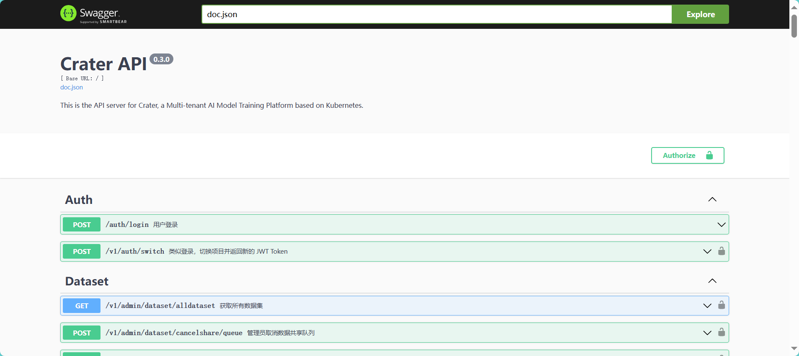

#  Crater Backend
Crater is a Kubernetes-based GPU cluster management system providing a comprehensive solution for GPU resource orchestration.

## 💻 Development Guide

Before getting started with development, please ensure your environment has the following tools installed:

- **Go**: Version `v1.24.4` is recommended  
  📖 [Go Installation Guide](https://go.dev/doc/install)

- **Kubectl**: Version `v1.33` is recommended  
  📖 [Kubectl Installation Guide](https://kubernetes.io/docs/tasks/tools/)

### 📐 Code Style & Linting

This project uses [`golangci-lint`](https://golangci-lint.run/) to enforce Go code conventions and best practices. To avoid running it manually, we recommend setting up a Git pre-commit hook to automatically check the code before each commit.

After installation, you might need to add your GOPATH to the system PATH so that golangci-lint can be used in the terminal. For example, on Linux:

```bash
# Check your GOPATH
go env GOPATH
# /Users/your-username/go

# Add the path to .bashrc or .zshrc
export PATH="/Users/your-username/go/bin:$PATH"

# Reload the shell and verify
golangci-lint --version
# golangci-lint has version 2.2.1
```
#### Setting Up Git Pre-Commit Hook

Copy the `.githook/pre-commit` script to your Git hooks directory and make it executable:

**Linux/macOS:**
```bash
cp .githook/pre-commit .git/hooks/pre-commit
chmod +x .git/hooks/pre-commit
```
Windows:

* Copy the script to .git/hooks/pre-commit

* Modify the script to replace golangci-lint with golangci-lint.exe if needed, or adapt it into a .bat file.

With the hook in place, golangci-lint will automatically run on staged files before each commit.

### 📄 API Documentation (Swagger)
We use Swag to generate OpenAPI documentation. Please install it before development:
```bash
go install github.com/swaggo/swag/cmd/swag@v1.16.3
```
Before running the backend, make sure to initialize Swagger docs:
```bash
swag init
```

#### 🛠️ Database Code Generation
The project uses GORM Gen to generate boilerplate code for database CRUD operations.

Generation scripts and documentation can be found in: [`gorm_gen`](./cmd/gorm-gen/README.md)

Please regenerate the code after modifying database models or schema definitions, while CI pipeline will automatically make database migrations.

### 🚀 Running the Project
Install dependencies and plugins:
```bash
go mod download
```

Create a `.debug.env` file at the root directory to customize local ports. This file is ignored by Git:

```env
CRATER_FE_PORT=xxxx
CRATER_BE_PORT=xxxx
CRATER_MS_PORT=xxxx
CRATER_HP_PORT=xxxx
```
You will also need access to a Kubernetes cluster. The cluster admin will provide a `kubeconfig` file. Copy it to the backend project root and rename it as `kubeconfig`:
```bash
cp ./kubeconfig ./web-backend/kubeconfig
```
Then you can start the backend server:

```bash
make run
```
If the server is running and accessible at your configured port, you can open the Swagger UI to verify:
```bash
http://localhost:<your-backend-port>/swagger/index.html#/
```


### 🐞 Debugging with VSCode
You can start the backend in debug mode using VSCode by pressing F5 (Start Debugging). You can set breakpoints and step through the code interactively.

Example launch configuration:
```json
 {
            "name": "Debug Server",
            "type": "go",
            "request": "launch",
            "mode": "auto",
            "program": "${workspaceFolder}/main.go",
            "env": {
                "KUBECONFIG": "${workspaceFolder}/kubeconfig",
                "CRATER_DEBUG_CONFIG_PATH": "${workspaceFolder}/etc/example-config.yaml",
            }
        }
```
`etc/example-config.yaml` is provided and you need to fill in relative values based on your deployment helm charts values.
